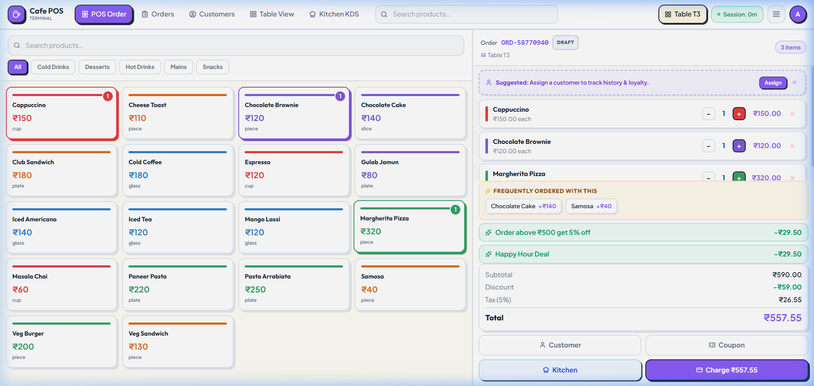
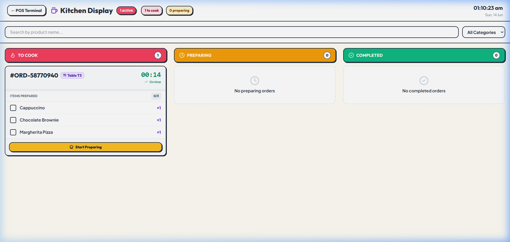
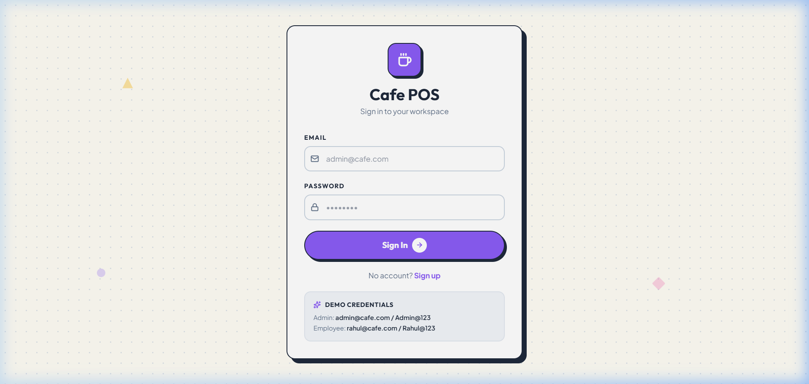

# Cafe POS - Full-Stack Point of Sale System

A production-ready, real-time Point of Sale (POS) system designed for cafes and restaurants. Built with Node.js, Prisma, PostgreSQL, React, and Socket.IO.

---

## System Overview

### POS Terminal Interface


### Kitchen Display System (KDS)


### Backend Administrative Dashboard


### Authentication Portal


---

## Core Features

### POS Terminal
* **Floor Plan & Table Management:** Live table occupancy status and quick selection.
* **Product Catalog:** Tabbed categorization with color-coded tags for fast navigation.
* **Smart Cart:** Automatic application of eligible promotions based on cart value.
* **Coupon Verification:** Validation engine supporting custom codes (e.g., WELCOME20, SAVE50, FLAT10).
* **Order Processing:** Seamless checkout supporting Cash (with change calculation), Card, and UPI payments (generates static dynamic-payment QR codes).
* **Receipt Management:** Print-ready formatting, email receipts, and instant order resets.
* **Real-time Kitchen Routing:** Socket.IO integration to route orders instantly to the kitchen display.

### Kitchen Display System (KDS)
* **Kanban Workflow:** Three-stage ticket flow (To Cook, Preparing, Completed).
* **Live Tickets:** Instant ticket arrival animations without page refreshes.
* **Granular Tracking:** Checklist system to tick off individual items as they are prepared.
* **Aging Indicator:** Visual cues based on ticket duration (green for under 10m, yellow for 10-15m, red pulsing border for over 15m).
* **Audio Alerts:** Sound notifications triggered on new incoming orders.

### Backend Administration
* **Analytical Insights:** Real-time revenue charts (line charts, category distribution charts) powered by Recharts.
* **Resource CRUDs:** Complete management interfaces for Products, Categories, Payment Methods, and Users.
* **Promotion Control:** Settings panel to manage active coupons and conditional promotion engines.
* **Export Options:** Data exports available in CSV and PDF formats.

---

## Demo Credentials

| Role | Email | Password |
|---|---|---|
| Admin | admin@cafe.com | Admin@123 |
| Employee | rahul@cafe.com | Rahul@123 |
| Employee | priya@cafe.com | Priya@123 |

---

## Live Demo URLs

| Page | Path / URL | Note |
|---|---|---|
| Portal Entry / Login | `/login` | Starting point for all roles |
| POS Terminal | `/pos` | Terminal interface for servers and cashiers |
| Kitchen Display (KDS) | `/kitchen` | Intended for kitchen monitors (open in a separate window) |
| Administration Panel | `/backend/dashboard` | Reports and system configuration |

*Note: Replace localhost or vercel-url prefixes with your deployed domain name when testing in production.*

---

## Standard Checkout Flow (60-Second Demo)

1. **Login:** Log in as `rahul@cafe.com`. Select Table **T3** from the floor plan.
2. **Add Items:** Add Cappuccino (x2) and Paneer Pasta to the order. Note the automatic 5% order promotion applied for totals exceeding threshold.
3. **Apply Coupon:** Enter `WELCOME20` in the coupon code field to verify additional discounts.
4. **Submit Order:** Click **Kitchen** to transmit the order details to the preparation queue.
5. **Kitchen View:** Open the Kitchen Display (`/kitchen`) in a new browser tab to see the order ticket populate instantly.
6. **Ticket State Transition:** Click the state action button to advance the ticket status to "Preparing".
7. **Finalize Payment:** Back on the POS Terminal, click **Charge**, select **UPI** as the payment method, and complete the transaction.
8. **Dashboard Verification:** Access the Backend Admin Panel to observe real-time updates in sales metrics.

---

## Tech Stack

| Component | Technologies |
|---|---|
| **Backend Framework** | Node.js, Express, Socket.IO |
| **Database & ORM** | PostgreSQL, Prisma v5 |
| **Authentication** | JWT (rotating Access and Refresh tokens) |
| **Frontend UI** | React, Vite, Tailwind CSS v3 |
| **State Management** | Zustand |
| **Data Visualization** | Recharts |
| **QR Generation** | qrcode.react |

---

## Project Structure

```text
cafe-pos/
├── backend/
│   ├── prisma/
│   │   ├── schema.prisma
│   │   └── seed.js
│   ├── src/
│   │   ├── middleware/     # JWT authentication, validation filters
│   │   ├── routes/         # Routing modules for transactions, users, and inventory
│   │   └── utils/          # Promotion calculation engine
│   ├── server.js
│   └── render.yaml
└── frontend/
    ├── src/
    │   ├── api/            # Base Axios client config
    │   ├── components/     # Reusable layout templates and POS layout blocks
    │   ├── pages/
    │   │   ├── backend/    # Admin view components (Dashboard, Products, Tables)
    │   │   ├── pos/        # POS interface modules
    │   │   └── kitchen/    # Kitchen monitor console
    │   └── store/          # Global client-side states (Zustand)
    └── vercel.json
```

---

## Installation & Configuration

### Prerequisites
* Node.js v18 or higher
* PostgreSQL database instance

### Backend Installation

1. Navigate to the backend folder:
   ```bash
   cd cafe-pos/backend
   ```
2. Install npm dependencies:
   ```bash
   npm install
   ```
3. Copy environment variables file and configure the values (e.g. `DATABASE_URL`, `JWT_SECRET`):
   ```bash
   cp .env.example .env
   ```
4. Perform database migration and seed default data:
   ```bash
   npx prisma migrate dev
   npx prisma db seed
   ```
5. Launch backend server:
   ```bash
   node server.js
   ```

### Frontend Installation

1. Navigate to the frontend folder:
   ```bash
   cd cafe-pos/frontend
   ```
2. Install dependencies:
   ```bash
   npm install
   ```
3. Run local development server:
   ```bash
   npm run dev
   ```

---

## Production Deployment

### Database (Supabase)
1. Initialize a new project on [Supabase](https://supabase.com).
2. Copy the Connection URI under project settings.
3. Update connection credentials, replacing placeholder passwords with your own.

### Backend Hosting (Render.com)
1. Create a Web Service connected to your repository on Render.
2. Designate `cafe-pos/backend` as the build root directory.
3. Set the required variables in your service Dashboard:
   * `DATABASE_URL`: Supabase Connection string
   * `JWT_SECRET` / `JWT_REFRESH_SECRET`: Random 32+ character strings
   * `FRONTEND_URL`: URL of the frontend deployment
   * `NODE_ENV`: `production`

### Frontend Hosting (Vercel)
1. Add a new Project in Vercel and import the repository.
2. Select `cafe-pos/frontend` as the root directory.
3. Add the `VITE_API_URL` environment variable pointing to your deployed Backend Web Service URL.
4. Trigger the deploy action.
